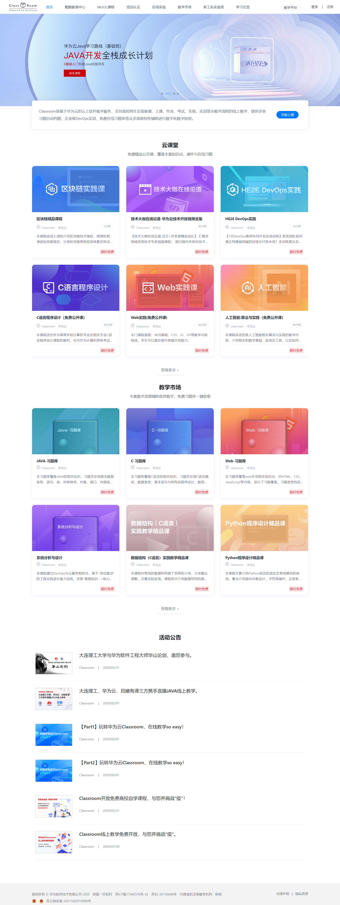
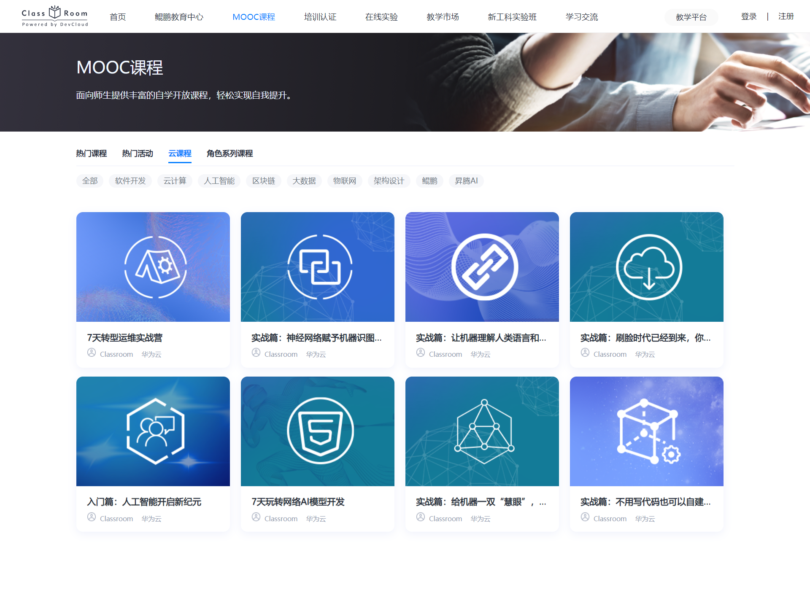
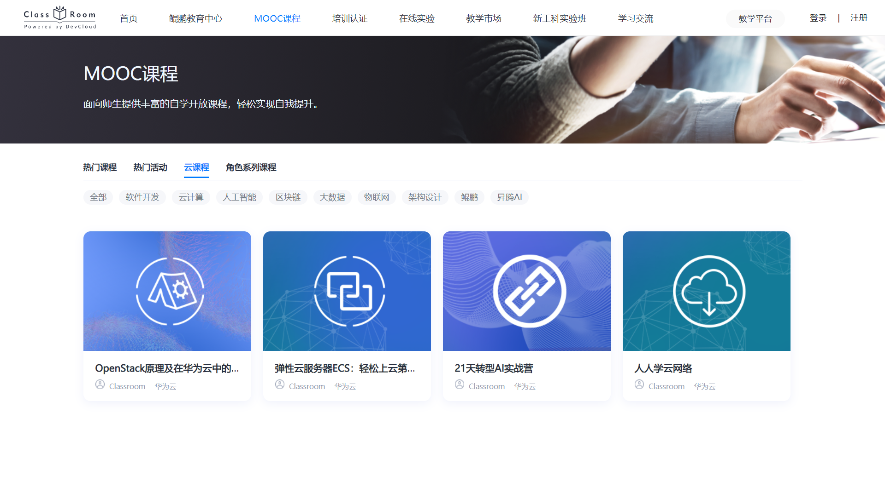

# huaweicloud
> **Github_page 线上地址** https://raotaohub.github.io/huaweiyuncloud/#/home
> A Vue.js project 这个小项目是我用Vue重构的[华为云-Classroom](https://classroom.devcloud.huaweicloud.com/home)这是目标网页

+ 在首页用bootstrap做的轮播图，尝试了一下bootstrap的响应式的页面开发。

+ 在MOOC课程页面运用了Vue-router子路由功能，同时实现了按标签分类。

+ 抽象出了Hearder、Card、Tag组件实现了部分复用。

- 首页效果



- MOOC





#### 安装和启动

``` bash
# 下载
git clone https://github.com/raotaohub/huaweiyuncloud.git

# install dependencies
npm install

# serve with hot reload at localhost:8080
npm run dev

# build for production with minification
npm run build

# build for production and view the bundle analyzer report
npm run build --report
```

For a detailed explanation on how things work, check out the [guide](http://vuejs-templates.github.io/webpack/) and [docs for vue-loader](http://vuejs.github.io/vue-loader).

